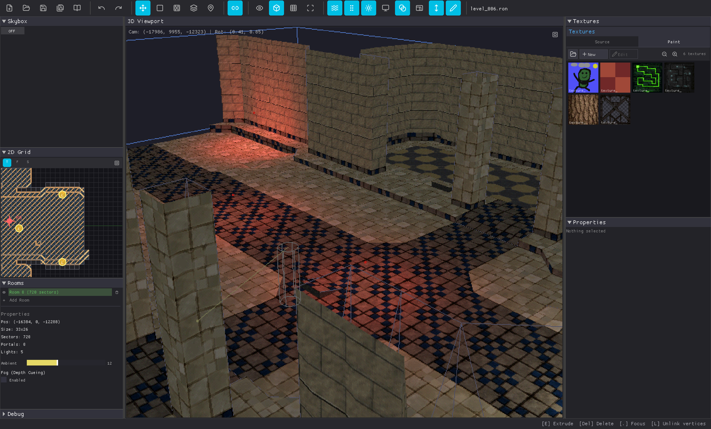
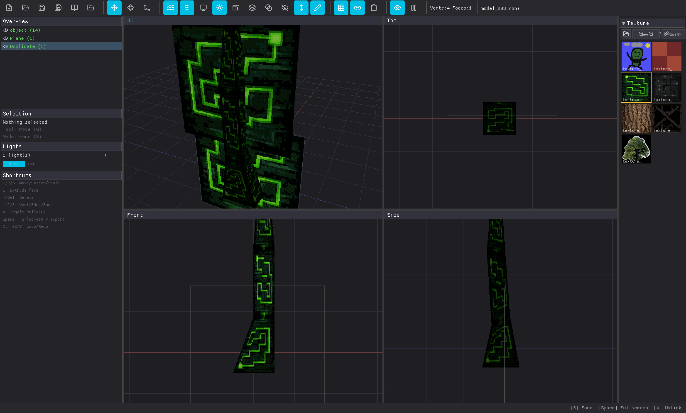

<p align="center">
  
</p>

<p align="center">
  <a href="https://github.com/ebonura/bonnie-32/releases"></a>
  <a href="LICENSE"></a>
  
</p>

<p align="center">
  <b>A Fantasy Console for PS1-Era 3D Games</b>
</p>

<p align="center">
  <a href="https://ebonura.github.io/bonnie-32"><b>Try in Browser</b></a> ·
  <a href="https://bonnie-games.itch.io/"><b>itch.io</b></a> ·
  <a href="https://buymeacoffee.com/bonniegames"><b>Buy Me a Coffee</b></a>
</p>

---

## What is BONNIE-32?

A complete toolkit for making low-poly 3D games targeting the PS1 aesthetic. Model, texture, compose music, and build levels in one place.

Each tool is focused and lightweight, designed around the constraints of early 3D. The software rasterizer natively produces typical PS1 quirks: affine texture mapping, vertex snapping, limited color depth, and no sub-pixel precision.

Built in Rust, runs on Windows, Mac, Linux, and browser.


## How the renderer works

The renderer is a software rasterizer written in Rust. It recreates PS1 visuals through optional rendering modes, inspired from how the hardware handled graphics:

| Feature | Effect |
|---------|--------|
| **Affine texture mapping** | No perspective correction, textures warp |
| **Vertex snapping** | Integer coordinates, geometry jitters |
| **RGB555 color** | 15-bit color with optional dithering |
| **No sub-pixel precision** | Polygons snap to pixel grid |
| **Painter's algorithm** | Back-to-front sorting instead of Z-buffer |

The renderer implements these natively as actual rendering techniques, not post-processing.

## Integrated Tools

Use the tabs at the top to switch between tools:

### World


Build levels using a sector-based editor in the style of the Tomb Raider Level Editor.
- 2D grid views (top/front/side) and 3D preview
- Texture painting with palette support
- Portal system for connecting rooms
- Asset placement with component system

### Assets


Low-poly mesh modeler featuring Blender-style controls, extrusion, multi-object editing, and a shared texture atlas. Heavily influenced by PicoCAD.
- 4-panel viewport (perspective + orthographic)
- G/R/T for grab, rotate, scale
- Texture atlas editor with indexed color
- UV editor
- OBJ import

### Music


A pattern-based tracker for composing music. Supports SF2 soundfonts, up to 8 channels, and classic tracker effects like arpeggio and vibrato.
- 8 channels, SF2 soundfont support
- PsyQ SDK reverb presets (Room, Studio, Hall, Space Echo...)
- MIDI keyboard input
- Tracker effects (arpeggio, vibrato, portamento)

### Game
Test the level you're working on.
- Third-person or free-fly camera
- Gamepad support
- Debug overlay

## Quick Start

### Try it now
[Web demo](https://ebonura.github.io/bonnie-32) runs in your browser.

### Build from source
```bash
git clone https://github.com/EBonura/bonnie-32.git
cd bonnie-32
cargo run --release
```

### Pre-built binaries
Download from [itch.io](https://bonnie-games.itch.io/) or [GitHub Releases](https://github.com/EBonura/bonnie-32/releases).

**macOS users**: Run from the extracted directory and remove quarantine if needed:
```bash
xattr -cr ~/Downloads/bonnie-32-macos-*
cd ~/Downloads/bonnie-32-macos-*
./bonnie-32
```

## Controls Reference

### Asset Editor
| Key | Action |
|-----|--------|
| `1` `2` `3` | Vertex / Edge / Face mode |
| `G` | Grab (move) |
| `R` | Rotate |
| `T` | Scale |
| `E` | Extrude |
| `X` `Y` `Z` | Axis constraint |
| `Space` | Toggle fullscreen viewport |
| `V` | Toggle UV/Build mode |

### World Editor
| Key | Action |
|-----|--------|
| `WASD` | Pan camera |
| `Shift+WASD` | Fast pan |
| `=` `-` | Zoom in/out |
| `1-6` | Select tool |
| `Drag object` | Move on XZ plane |
| `Shift+Drag` | Adjust height (Y axis) |

### Music Tracker
| Key | Action |
|-----|--------|
| `Z`-`M` / `Q`-`P` | Piano keys (2 octaves) |
| `Space` | Play/Stop |
| `Arrow keys` | Navigate pattern |

## Technical specs

Hardware constraints:

| Spec | Value |
|------|-------|
| Resolution | 320×240 |
| Color depth | RGB555 (15-bit) |
| Texture format | 4-bit or 8-bit indexed |
| Max texture size | 256×256 |
| Audio | 8 channels, 44.1kHz |


## Contributing

Contributions welcome! Please open an issue first to discuss changes.

See [CONTRIBUTING.md](CONTRIBUTING.md) for guidelines.

## Credits

Made by [Emanuele Bonura](https://bonnie-games.itch.io/).

Software rasterizer based on [tipsy](https://github.com/nkanaev/tipsy) by nkanaev.

### Included Texture Packs
- [Retro Texture Pack](https://little-martian.itch.io/retro-textures-pack) by Little Martian
- [Low Poly 64x64 Textures](https://phobicpaul.itch.io/low-poly-64x64-textures) by PhobicPaul
- [Quake-Like Texture Pack](https://level-eleven-games.itch.io/quake-like-texture-pack) by Level Eleven Games
- [Dark Fantasy Townhouse](https://level-eleven-games.itch.io/dark-fantasy-townhouse-64x64-texture-pack) by Level Eleven Games
- [Tiny Texture Pack 1](https://screamingbrainstudios.itch.io/tiny-texture-pack), [2](https://screamingbrainstudios.itch.io/tiny-texture-pack-2), [3](https://screamingbrainstudios.itch.io/tiny-texture-pack-3) by Screaming Brain Studios

See [THIRD_PARTY.md](THIRD_PARTY.md) for full license information.

## License

[MIT](LICENSE)

---

*BONNIE-32 is under active development. Expect breaking changes between versions.*
